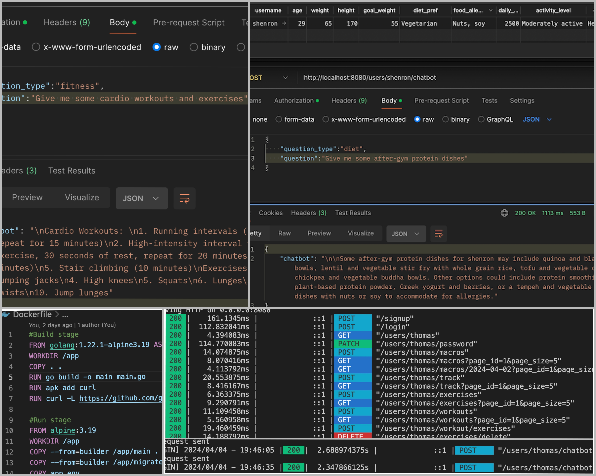
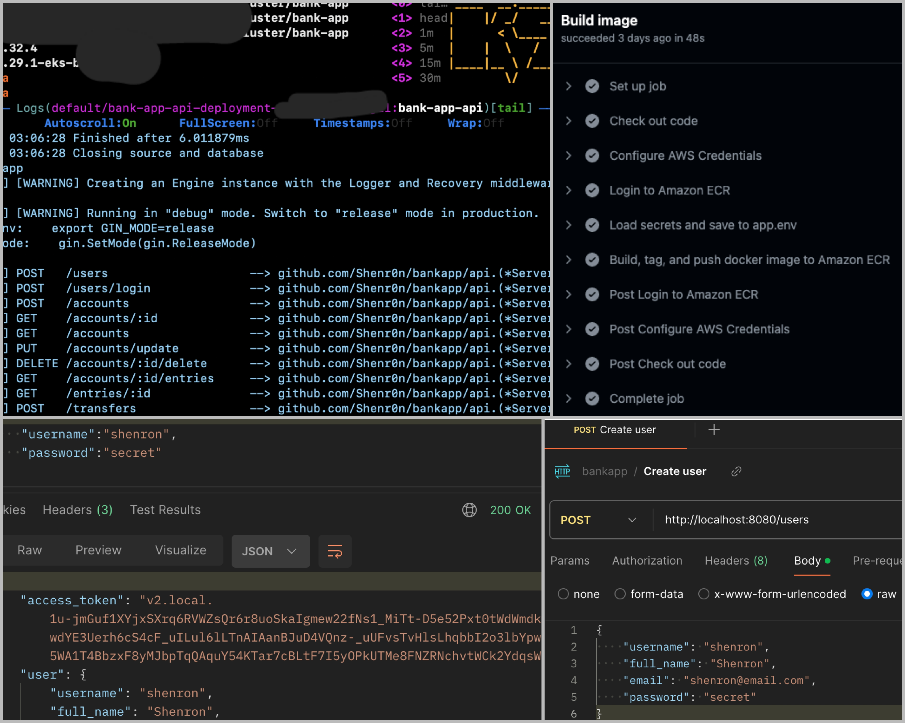
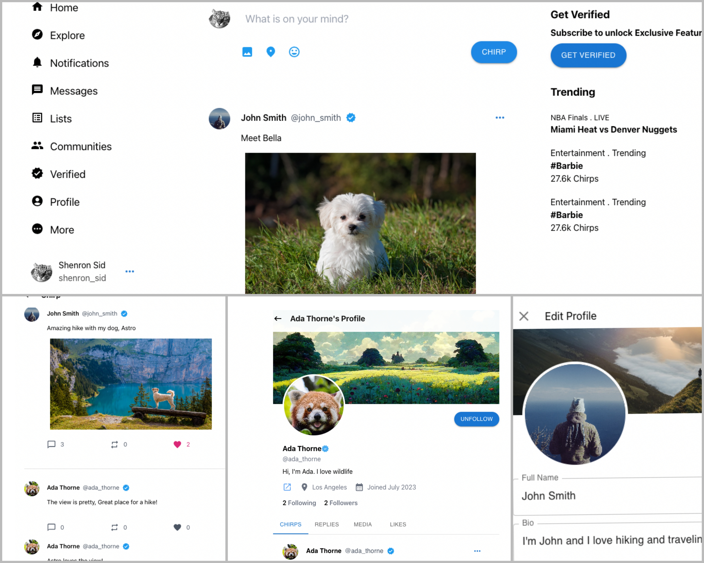

<h2 align="center">Hello, I'm Siddhesh Shinde </h2>
<h3 align="center">Software Engineer | Backend Developer</h3>

## 💫 About Me

- Software Engineer / Backend Developer.
- Experience in REST and Web APIs, Object Relational Mapping, Middleware, Web servers, databases, microservices.

## 📁 My Projects
- [Fitness Tracker with AI powered trainer](https://github.com/Shenr0n/fitness-app)
    - Engineered 25 REST APIs for tracking workout routines, nutrition, customizable exercises, and health progress.
    - Integrated OpenAI API for a personalized chatbot, leveraging user’s data for tailored diet and fitness guidance.
    - Utilized Go with Gin, PostgreSQL, and sqlc for implementing CRUD services and authentication middleware.
    - Leveraged PASETO for user session and authorizing API requests, and Docker for containerization.

    

- [Banking Backend](https://github.com/Shenr0n/bankapp)
    - Developed over 15 RESTful APIs for admin and user operations, including user and account management, and seamless transactions, using Go, Gin, PostgreSQL, sqlc.
    - Created authentication middleware to authorize API requests, with PASETO, and built exhaustive unit tests.
    - Implemented CI/CD pipelines for automated testing, database migration, containerization, and deployment,
utilizing Github Actions, Docker, Kubernetes, Amazon Web Services (ECR, RDS, EKS and IAM).

    
    
- [Microblogging Social Media](https://github.com/Shenr0n/chirp-microblogging)
    - A full-stack web application mirroring X’s functionality using Java 17, Spring, React, Tailwind CSS and MySQL.
    - Designed 17 REST APIs, 16 functionalities for users, with MVC architecture, DAOs and DTOs.
    - Implemented multimedia-rich post capabilities, social interactions, account and profile management, sessions.
    - Utilized Java Persistence API for ORM, and Spring Security with JWT, Redux for state management, and MUI.

    

----
